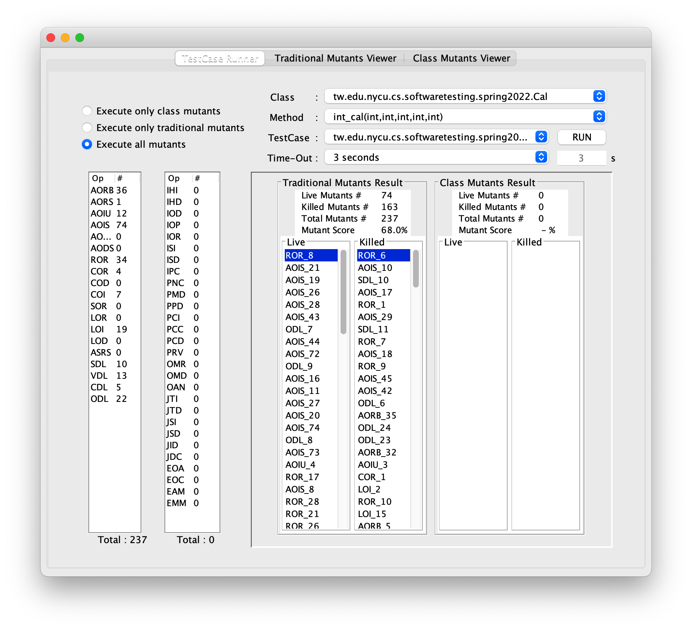
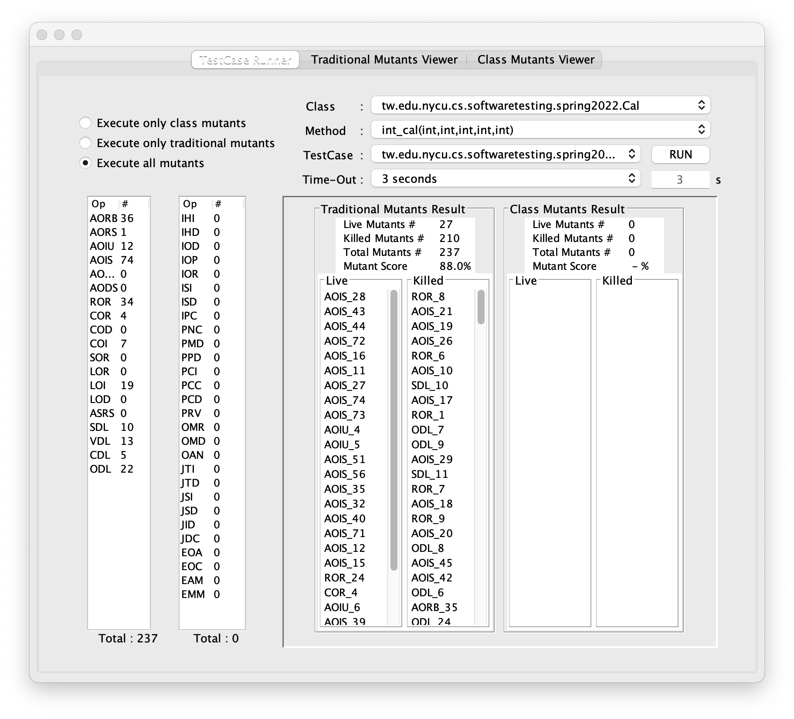

# Homework 4: Mutation Based Testing

## 作者

- 學號: 310551017
- 姓名: 王志嘉

## 評測環境

- 系統: macOS 12.4 (21F79), Darwin 21.5.0
- Java 開發環境等相關配置
  - openjdk version "1.8.0_282"
  - OpenJDK Runtime Environment (build 1.8.0_282-b07)
  - OpenJDK 64-Bit Server VM GraalVM CE 21.0.0.2 (build 25.282-b07-jvmci-21.0-b06, mixed mode)
  - Apache Maven 3.8.5 (3599d3414f046de2324203b78ddcf9b5e4388aa0)

## 問題

- How many mutants are there?
  - 如果選擇 `All method` 的話, 則有 243 個變異
  - 但是如果選擇 `int_cal(int,int,int,int,int)`, 就會只剩 237 個變異
- How many test cases do you need to kill the non-equivalent mutants?
  - 我最後寫了 11 個 test cases 才幹掉 210 個突變體, 我想應該有優化的空間
- What mutation score were you able to achieve before analyzing for equivalent
mutants?
  - 在剛開始時, 我只有寫前五個 test cases, 變異結果的分數只有 68.0%
    
  - 而後, 我又分析了哪些是等效變異之後，我又添加了其他六個 test cases, 最後得到了 88.0% 的變異分數
    
- How many equivalent mutants are there?
  - 最終有 27 個等效變異在 `int_cal(int,int,int,int,int)` 方法中
    

## Source code

- <https://github.com/t106362512/ST-2022-310551017/tree/hw4-add-mutation-based-testing/HW_4>

## 其他

- 或許未來的課程可以改使用 [PiTest](http://pitest.org/) 來做變異測試, 它有快和可擴充並與測試及建構工具集成好的優點
- 重點是他沒有 [mujava](https://cs.gmu.edu/~offutt/mujava/) 過時和無人維護以及 bug 很多的問題
- 再來, [PiTest](http://pitest.org/) 有很好的整合 [maven](https://maven.apache.org/), 可以以 plugin 的形式去使用它, 並且能很好地整合在 CI Pipeline 上, 最後也能產生出測試報告. 不像 [mujava](https://cs.gmu.edu/~offutt/mujava/) 一樣, 中間強迫你使用 GUI
