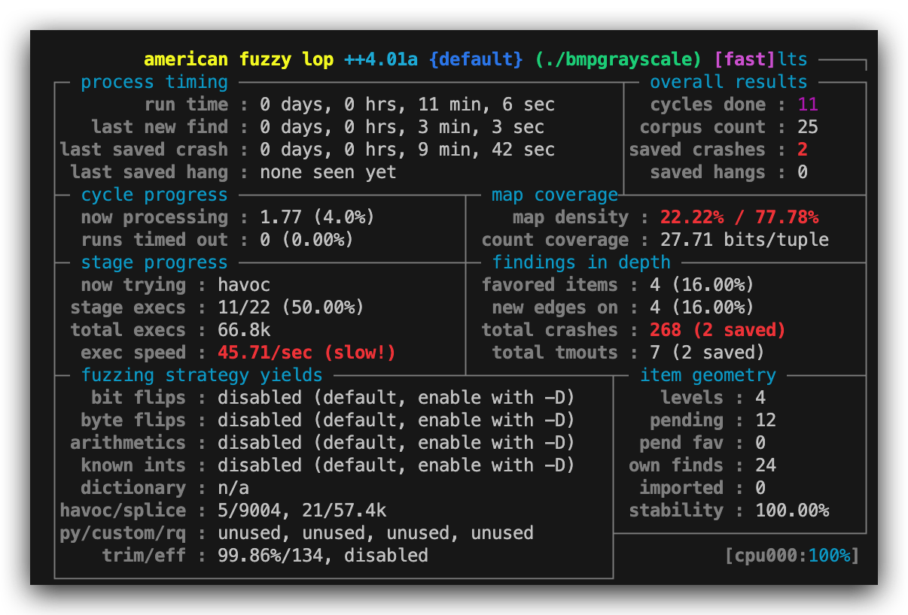
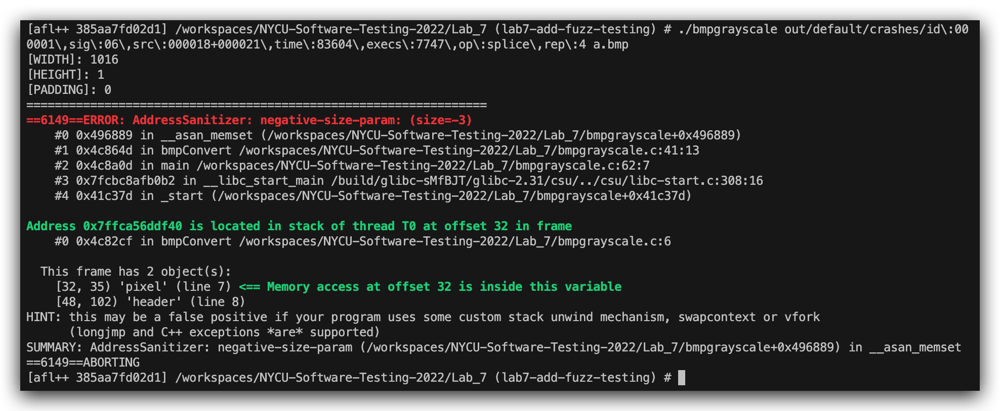

# Lab 7: Fuzz Testing

1. We provide a small program that converts bmp from color to grayscale.
   - Use **AFL++** to find the file that can trigger the vulnerability.
   - Use **test.bmp** as init seed.
2. Deliverables shall include the following:
   - PoC: the file that can trigger the vulnerability
   - Screenshot of AFL++ running (with triggered crash): STUDENT_ID.png

**Do not compress the files and plagiarism!**

## 使用說明

1. 使用 Docker, VSCode, Remote-Containers 插件來建立開發環境所需之應用及 VSCode 插件
2. 使用 `make afl` 即可執行 fuzz, 然後掃描到幾圈後, 可以按 `ctl + c` 終止 fuzz
3. 使用 `afl-fuzz` 之輸出 crash 即可復現問題, 具體使用方法可參考以下

   ```bash
   ./bmpgrayscale out/default/crashes/id\:000001\,sig\:06\,src\:000018+000021\,time\:83604\,execs\:7747\,op\:splice\,rep\:4 fake.bmp
   ```

## 使用原因

- 用 Dev Container 並搭配 VSCode IDE 開發比較方便
- 不會污染環境且單純, 使用完即可丟棄

## 結果

- fuzz 時的截圖
  

- 錯誤復現結果
  
